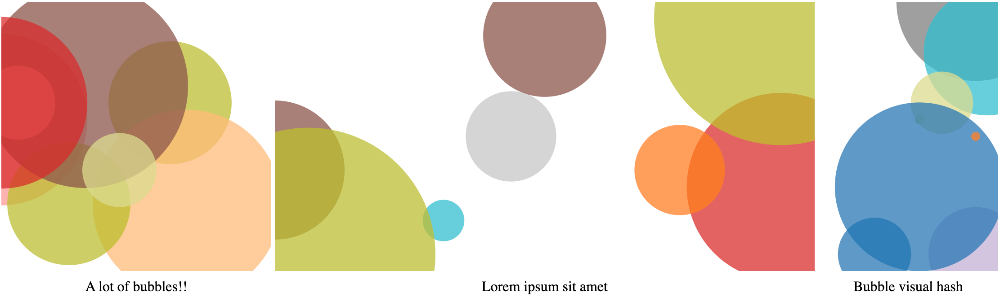

# bubble-visual-hash

[](https://luost26.github.io/bubble-visual-hash)

[](https://hits.seeyoufarm.com)

Bubble Visual Hash is a standalone script that creates a visual hash image from any given string. The image consists of colorful bubbles and can be used as placeholders for user profile pictures or cover images.

[Click here to see the demo.](https://luost26.github.io/bubble-visual-hash)


## Usage

First, include the script in your HTML file, preferably in the `<head>` section:

```html
<script src="bubble_visual_hash.js"></script>
```

Then, create `svg` element with the `bubble-visual-hash` class, set the `data-bubble-visual-hash` attribute to the string you want to generate the visual hash for, and set the `viewBox` attribute to the desired size of the visual hash:

```html
<svg class="bubble-visual-hash" data-bubble-visual-hash="Bubble visual hash" viewBox="0 0 300 200"></svg>
```

Finally, call the `renderBubbleVisualHash(canvas)` function to generate the visual hash for each `svg` element. This script should be placed at the end of the HTML file, right before the closing `</body>` tag:

```html
<script>
    var canvases = document.querySelectorAll(".bubble-visual-hash");
    canvases.forEach(renderBubbleVisualHash);
</script>
```

## Acknowledgement

[dakridge/identicon](https://github.com/dakridge/identicon) - The script is based on the identicon script by dakridge.
